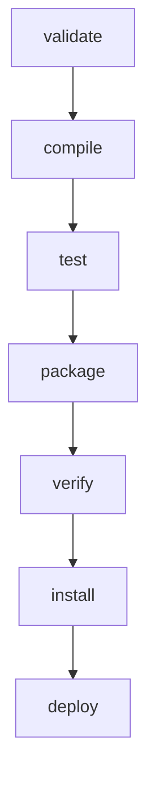

# 🚀 Maven Build Lifecycle in Depth

## 🔄 What is a Build Lifecycle?

* A **lifecycle** is a sequence of build **phases** in Maven.
* Each phase represents a stage in the build process.
* Phases are bound to **plugin goals** that perform tasks.

👉 When you run a lifecycle phase, Maven executes **all previous phases** automatically.

**Example:**

```bash
  mvn package
```

This runs:
`validate → compile → test → package`

---

## 🏗️ Three Built-in Lifecycles

Maven has **3 standard lifecycles**:

### 1. **default** (handles project deployment)

* Covers **compilation → packaging → installation → deployment**.

### 2. **clean** (handles project cleaning)

* Deletes previous build output (`target/`).

### 3. **site** (handles documentation)

* Generates project documentation website.

---

## 📦 Common Phases in Default Lifecycle

1. **validate** → Check project structure & `pom.xml` correctness.
2. **compile** → Compile source code.
3. **test** → Run unit tests.
4. **package** → Package compiled code into JAR/WAR.
5. **verify** → Run integration tests & checks.
6. **install** → Install artifact into local repository (`~/.m2/repository`).
7. **deploy** → Deploy artifact to remote repository.

👉 Example command:

```bash
  mvn install
```

This runs all phases **up to install**.

---

## 🧹 Clean Lifecycle

* Used to remove build artifacts.
* Command:

```bash
    mvn clean
```

Deletes `target/` folder before rebuilding.

---

## 📖 Site Lifecycle

* Generates documentation & reports.
* Command:

```bash
  mvn site
```

Creates `target/site/index.html`.

---

## 📊 Visualization of Default Lifecycle



---

## 🧪 Hands-On: Playing with Lifecycles

1. Run:

   ```bash
   mvn clean compile
   ```

   👉 Deletes `target/`, then compiles code.
2. Run:

   ```bash
   mvn package
   ```

   👉 Compiles, tests, and packages.
3. Run:

   ```bash
   mvn install
   ```

   👉 Adds JAR/WAR to local Maven repository.

---

### 📌 Key Notes

* Maven has **3 lifecycles**: default, clean, site.
* Each lifecycle has **phases** bound to plugin goals.
* Running a phase also runs all **previous phases**.
* Commonly used phases: `compile`, `test`, `package`, `install`, `deploy`.

---

<div style="display: flex; justify-content: space-between;">

[](05-BUILD_PLUGINS_N_GOALS.md)

[](07-MULTI_MODULE_PROJ.md)

</div>

[](../README.md)

---